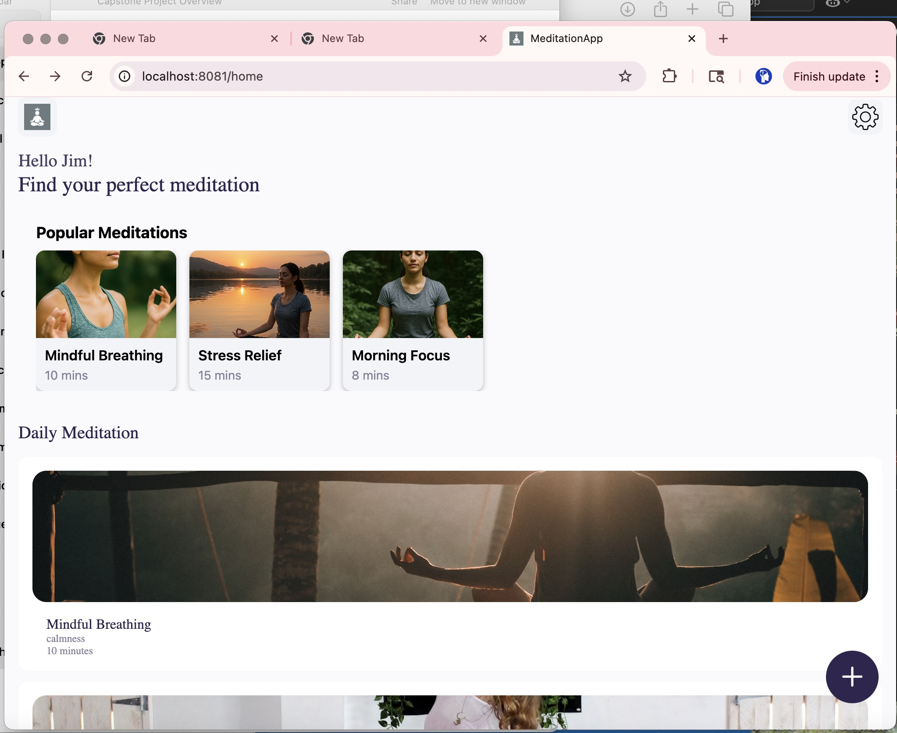
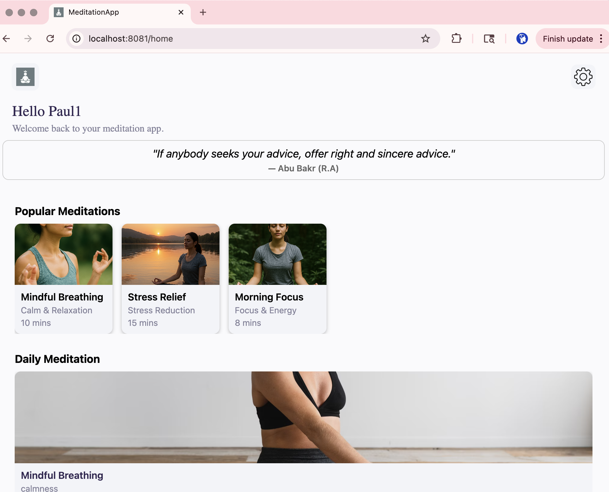
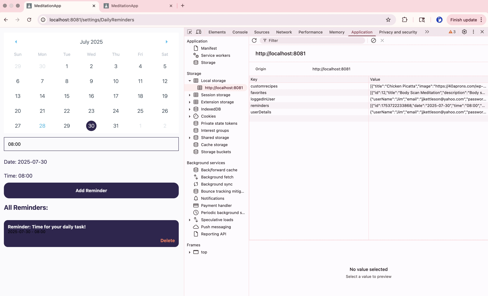
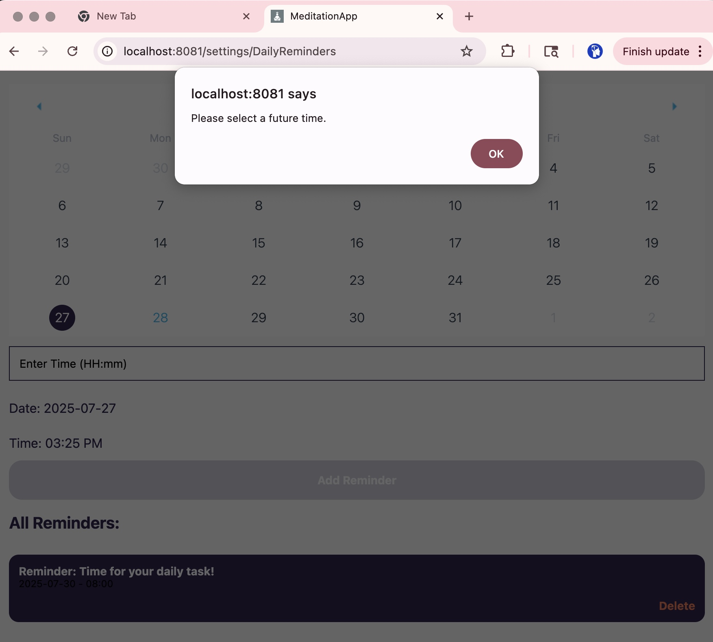
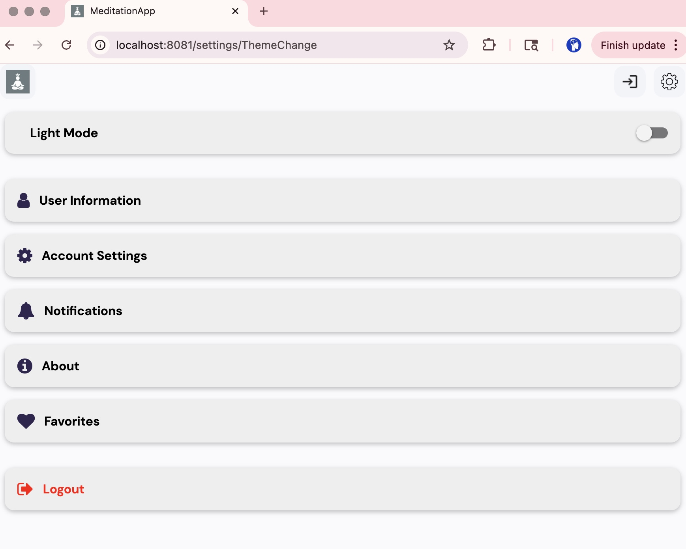

# meditationApp
# 🧘 Meditation App – Marketplace Listing

## 📱 App Name
**MeditationApp**

## 📝 Short Description
Calm your mind and energize your soul with personalized daily meditations, reminders, and relaxing quotes.

## 📄 Full Description
MeditationApp is your personalized mindfulness companion. Whether you're a beginner or a seasoned meditator, our app helps you build a consistent routine with features like:
- Daily guided meditations
- Inspirational quotes
- Custom reminders
- Dark/light mode
- Favorites screen
- Notification scheduling

Start your day with peace, focus, and clarity.

## 🔑 Keywords
meditation, mindfulness, wellness, self-care, stress relief, breathing, daily quotes, reminders

## 🖼️ Screenshots

| Home | Daily Quote | Reminders | Notifications | Settings |
|------|-------------|-----------|----------------|----------|
|  |  |  |  |  |

## 📦 App Details
- **Platform**: Android (Google Play)
- **Package Name**: `com.kettleson1.MeditationApp`
- **Version**: 1.0.0
- **Language**: English
- **Minimum OS**: Android 8.0 (API level 26)

## Privacy
See [privacy-policy.md]

## Monetization
- Free version includes daily meditation and reminders
- Planned Premium features: advanced meditations, playlist creation
- Potential: $2.99 one-time or $1.99/month
## Marketing Plan

### App Store Optimization (ASO)
- Keywords: meditation, mindfulness, relaxation
- Screenshots show reminders, daily quotes, and calm UI
- Compelling app icon and splash screen

### Social Media
- Promote on Instagram and TikTok using #MindfulMoments #MeditationApp
- Use testimonials and peaceful visuals

### Website/Landing Page
- Link: www.davesystemsinc.com
- Feature highlights, testimonials, and download links